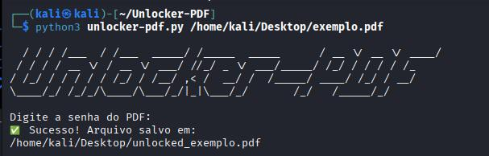

# PDF Unlocker 🔓

Script em Python para remover senhas de arquivos PDF gerando uma cópia do arquivo original com o prefixo `unlocked_`, mantendo o documento original intacto.

## Funcionalidades
* **Segurança:** Solicita a senha de forma oculta no terminal (não exibe os caracteres enquanto você digita).
* **Praticidade:** Funciona diretamente via linha de comando.
* **Preservação:** Não altera o arquivo original.

## Pré-requisitos
* Python 3.x
* Biblioteca `pypdf`

## Instalação e Uso

1. Instale a biblioteca necessária:
   ```bash
   pip install pypdf
2. Modo de uso:
    ```bash
   python3 unlocker-pdf.py nome_do_arquivo.pdf

## Exemplo


